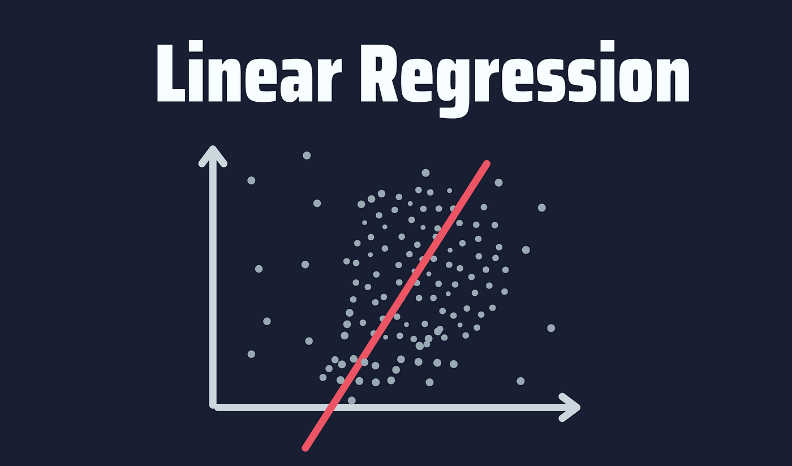

  

# LinearRegressionHub

Welcome to the Linear Regression Repository! This repository houses a collection of carefully crafted linear regression models designed for diverse applications.

## 🚀 Getting Started

### Prerequisites

Make sure you have the following Python libraries installed:

- [Pandas](https://pandas.pydata.org/): `pip install pandas`
- [NumPy](https://numpy.org/): `pip install numpy`
- [scikit-learn](https://scikit-learn.org/): `pip install scikit-learn`
- [Matplotlib](https://matplotlib.org/): `pip install matplotlib`

## 📄 Necessary Steps for Preprocessing Data
- Handling Missing Values:
Decide on a strategy for handling missing values (e.g., dropping, imputing).
- Encoding Categorical Variables:
Identify categorical variables and decide on an encoding method (e.g., one-hot encoding).
- Scaling Numerical Features:
Choose a scaling method for numerical features (e.g., Min-Max scaling, Standard scaling).
Implement the chosen scaling method in your script.
- Feature Engineering (if applicable):
Create new features or transform existing features to enhance model performance.
